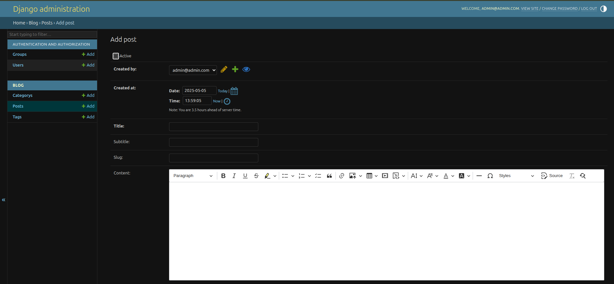

# DRF Blog with CKEditor 📝

A feature-rich blog backend built with **Django Rest Framework** and integrated **CKEditor** for rich text editing. This project is designed to showcase modular, scalable, and production-ready API development using Django.


---

## 🚀 Features

- ✅ Full CRUD for blog posts
- ✅ Rich text editing using `django-ckeditor`
- ✅ Image upload support
- ✅ JWT Authentication
- ✅ Pagination & filtering
- ✅ Clean code architecture (views, serializers, permissions)
- ✅ Admin panel with CKEditor support
- ✅ Dockerized for local development

---

## 📸 Admin Panel



---

## 📦 Tech Stack

- **Python 3.10+**
- **Django 4.x**
- **Django Rest Framework**
- **django-ckeditor**
- **Simple JWT**
- **PostgreSQL**
- **Docker & Docker Compose**
---

## 🧑‍💻 Installation

1. **Clone the repo**
   ```bash
   git clone https://github.com/diaco-dev/drf-blog-with-ckeditor.git 
   cd drf-blog-with-ckeditor
  
2. **Create and activate virtual environment**
   ```bash
   python -m venv env
   source env/bin/activate
     ```
3. **Install dependencies**
   ```bash
   pip install -r requirements.txt
   ```
4. **Apply migrations**
   ```bash
   python manage.py migrate
   ```
5. **Run development server**
   ```bash
   python manage.py runserver
   ```

